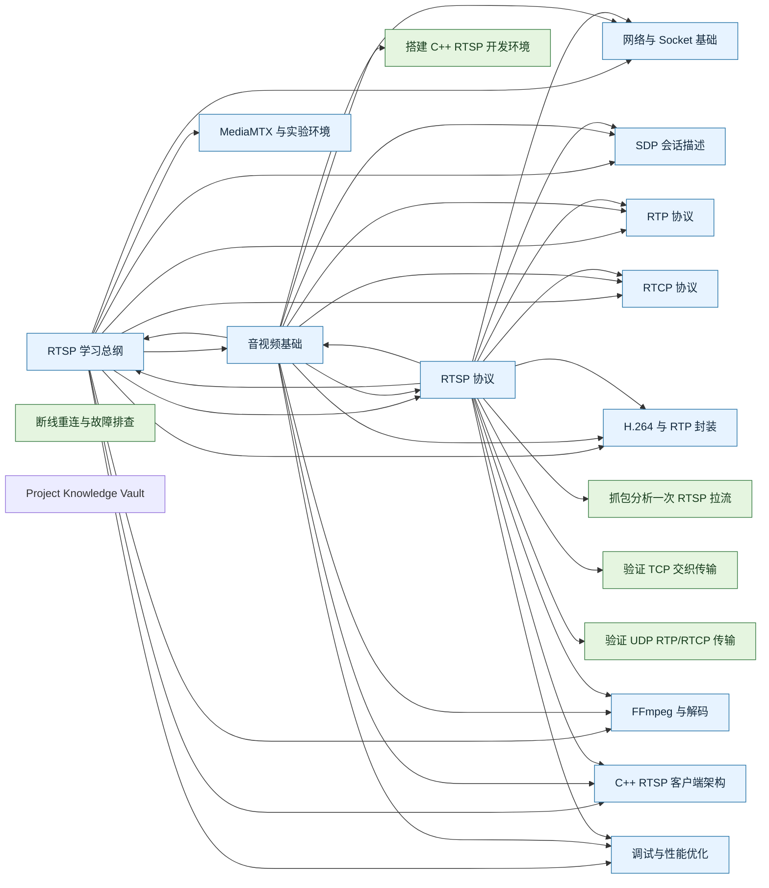

# Knowledge Graph

Generated on 2026-10-18. Obsidian users can also use the native graph view.

```mermaid
graph LR
    n0["RTSP 学习总纲"]
    class n0 topic
    n1["网络与 Socket 基础"]
    class n1 topic
    n2["音视频基础"]
    class n2 topic
    n3["RTSP 协议"]
    class n3 topic
    n4["SDP 会话描述"]
    class n4 topic
    n5["RTP 协议"]
    class n5 topic
    n6["RTCP 协议"]
    class n6 topic
    n7["H.264 与 RTP 封装"]
    class n7 topic
    n8["FFmpeg 与解码"]
    class n8 topic
    n9["MediaMTX 与实验环境"]
    class n9 topic
    n10["C++ RTSP 客户端架构"]
    class n10 topic
    n11["调试与性能优化"]
    class n11 topic
    n12["搭建 C++ RTSP 开发环境"]
    class n12 runbook
    n13["抓包分析一次 RTSP 拉流"]
    class n13 runbook
    n14["验证 TCP 交织传输"]
    class n14 runbook
    n15["验证 UDP RTP/RTCP 传输"]
    class n15 runbook
    n16["断线重连与故障排查"]
    class n16 runbook
    n17["Project Knowledge Vault"]
    n0 --> n1
    n0 --> n2
    n0 --> n3
    n0 --> n4
    n0 --> n5
    n0 --> n6
    n0 --> n7
    n0 --> n8
    n0 --> n9
    n0 --> n10
    n0 --> n11
    n2 --> n0
    n2 --> n1
    n2 --> n3
    n2 --> n4
    n2 --> n5
    n2 --> n6
    n2 --> n7
    n2 --> n8
    n2 --> n10
    n2 --> n11
    n2 --> n12
    n3 --> n0
    n3 --> n1
    n3 --> n2
    n3 --> n4
    n3 --> n5
    n3 --> n6
    n3 --> n7
    n3 --> n8
    n3 --> n10
    n3 --> n11
    n3 --> n13
    n3 --> n14
    n3 --> n15
    classDef session fill:#f4f4f4,stroke:#666,color:#222
    classDef topic fill:#e7f3ff,stroke:#2774a8,color:#13293d
    classDef decision fill:#fff2cc,stroke:#a67c00,color:#3d3000
    classDef runbook fill:#e5f5e0,stroke:#3a7d44,color:#173d1d
    classDef snippet fill:#f3e8ff,stroke:#7651a8,color:#2f1b47
    classDef archived fill:#eeeeee,stroke:#999,color:#555
```
