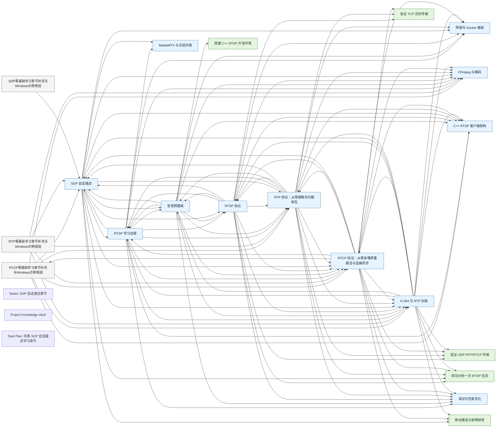

# Knowledge Graph

Generated on 2026-10-20. Obsidian users can also use the native graph view.

```mermaid
graph LR
    n0["RTCP零基础学习章节补充与Windows示例核验"]
    class n0 session
    n1["RTP零基础学习章节补充与Windows示例核验"]
    class n1 session
    n2["SDP零基础学习章节补充与Windows示例核验"]
    class n2 session
    n3["RTSP 学习总纲"]
    class n3 topic
    n4["网络与 Socket 基础"]
    class n4 topic
    n5["音视频基础"]
    class n5 topic
    n6["RTSP 协议"]
    class n6 topic
    n7["SDP 会话描述"]
    class n7 topic
    n8["RTP 协议：从零理解实时媒体包"]
    class n8 topic
    n9["RTCP 协议：从零读懂质量报告与音画同步"]
    class n9 topic
    n10["H.264 与 RTP 封装"]
    class n10 topic
    n11["FFmpeg 与解码"]
    class n11 topic
    n12["MediaMTX 与实验环境"]
    class n12 topic
    n13["C++ RTSP 客户端架构"]
    class n13 topic
    n14["调试与性能优化"]
    class n14 topic
    n15["搭建 C++ RTSP 开发环境"]
    class n15 runbook
    n16["抓包分析一次 RTSP 拉流"]
    class n16 runbook
    n17["验证 TCP 交织传输"]
    class n17 runbook
    n18["验证 UDP RTP/RTCP 传输"]
    class n18 runbook
    n19["断线重连与故障排查"]
    class n19 runbook
    n20["Notes: SDP 会话描述章节"]
    n21["Project Knowledge Vault"]
    n22["Task Plan: 完善 SDP 会话描述学习章节"]
    n0 --> n7
    n0 --> n8
    n0 --> n9
    n0 --> n10
    n0 --> n11
    n0 --> n13
    n1 --> n7
    n1 --> n8
    n1 --> n9
    n1 --> n10
    n1 --> n11
    n2 --> n7
    n3 --> n4
    n3 --> n5
    n3 --> n6
    n3 --> n7
    n3 --> n8
    n3 --> n9
    n3 --> n10
    n3 --> n11
    n3 --> n12
    n3 --> n13
    n3 --> n14
    n5 --> n3
    n5 --> n4
    n5 --> n6
    n5 --> n7
    n5 --> n8
    n5 --> n9
    n5 --> n10
    n5 --> n11
    n5 --> n13
    n5 --> n14
    n5 --> n15
    n6 --> n3
    n6 --> n4
    n6 --> n5
    n6 --> n7
    n6 --> n8
    n6 --> n9
    n6 --> n10
    n6 --> n11
    n6 --> n13
    n6 --> n14
    n6 --> n16
    n6 --> n17
    n6 --> n18
    n7 --> n3
    n7 --> n4
    n7 --> n5
    n7 --> n6
    n7 --> n8
    n7 --> n9
    n7 --> n10
    n7 --> n11
    n7 --> n12
    n7 --> n13
    n7 --> n16
    n7 --> n19
    n8 --> n3
    n8 --> n4
    n8 --> n5
    n8 --> n6
    n8 --> n7
    n8 --> n9
    n8 --> n10
    n8 --> n11
    n8 --> n13
    n8 --> n14
    n8 --> n16
    n8 --> n17
    n8 --> n18
    n9 --> n0
    n9 --> n3
    n9 --> n4
    n9 --> n6
    n9 --> n7
    n9 --> n8
    n9 --> n10
    n9 --> n11
    n9 --> n13
    n9 --> n14
    n9 --> n16
    n9 --> n17
    n9 --> n18
    n9 --> n19
    n10 --> n3
    n10 --> n4
    n10 --> n5
    n10 --> n6
    n10 --> n7
    n10 --> n8
    n10 --> n9
    n10 --> n11
    n10 --> n13
    n10 --> n14
    n10 --> n16
    n10 --> n18
    n10 --> n19
    classDef session fill:#f4f4f4,stroke:#666,color:#222
    classDef topic fill:#e7f3ff,stroke:#2774a8,color:#13293d
    classDef decision fill:#fff2cc,stroke:#a67c00,color:#3d3000
    classDef runbook fill:#e5f5e0,stroke:#3a7d44,color:#173d1d
    classDef snippet fill:#f3e8ff,stroke:#7651a8,color:#2f1b47
    classDef archived fill:#eeeeee,stroke:#999,color:#555
```
